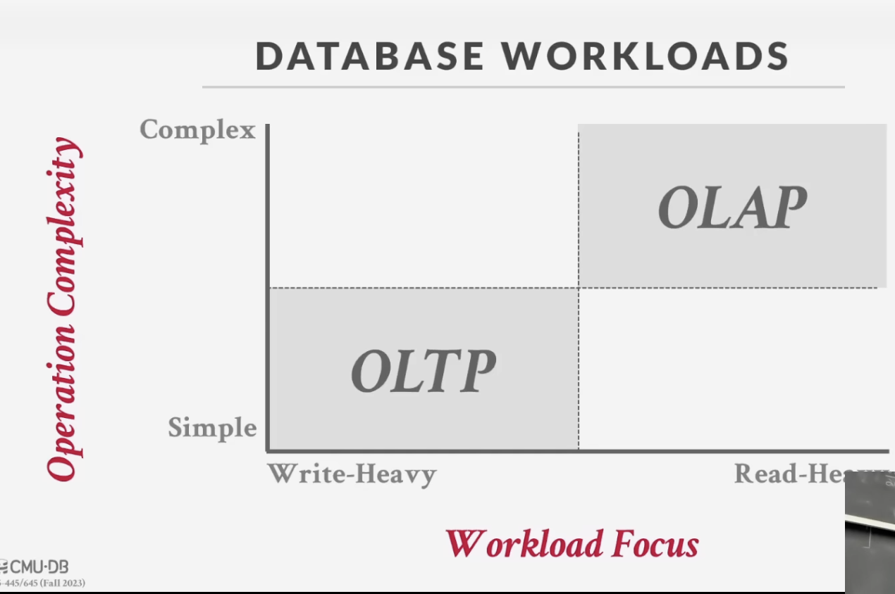
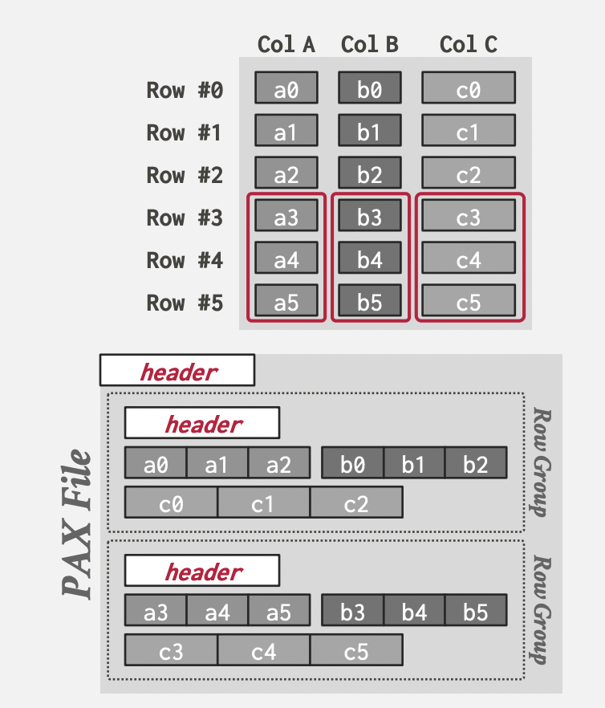

# CMU 15-445 notes

### Lecture 1 - Intro to databases

- computers are powerful because they can perform fast and accurate computations on vast amounts of data.

- databases are software which can organize collections of inter-related data that model some aspect of the real world. How do we implement this?

	- flat file database: store relational data as comma seperated values files.
		- inefficient querying if database is too large (have to search line by line)
		- need to parse data for every query
		- how do we deal with duplicates?
		- how do we deal with different threads using the same db file?
		- how do we deal with machine crashes in the middle of updates?
		- what if we the file gets too big for a single machine and we need to split the db per multiple machines?

- A database management system (DBMS) is software that allows creation, querying, updating and administration of databases and takes care of above concerns and more.

- A _data model_ is an abstraction to describe the data living in a database. A _schema_ defines what a certain collection of data looks like.

- Some example data models: relational, key-value, graph, document/object, array/matrix

#### Relational model
- data is abstractly stored as relations
- this data can be accessed using high-level language and DBMS figures out best execution strategy
- the internal storage implementation of data is up to DBMS (tree, index, hash etc.)
- every real-world data entity has _attributes_ which describes the entity. a _relation_ is a set of entities with certain attributes. a _tuple_ is a set of attribute values (or the domain) in the relation.
- n-ary relation = n-column table; tuple = row in relation
- a relation's _primary key_ attribute (or set of attributes) uniquely identifies a single tuple
- a _foregin key_ is a common attribute between different relations that defines relationships between foreign entities of different cardinalites like:
	- one-to-one
	- one-to-many: note that lecturer admits we can just use an array to store the "many" attribute values in the secondary relation which all have the same foregin key found once in the primary relation.
	- many-to-many
- procedural (relational algebra) and non-procedural/declarative (relational calculus) primitives to access/query data inside relations.
- relational algebra operators: SELECT, PROJECTION, UNION, INTERSECTION, DIFFERENCE, PRODUCT, JOIN. The order of operations in a query can affect performance.
- SQL is a declarative de facto standard query language implemenation for relational models.

#### Object/document model
- examples: mongodb, elastic, couchbase, dynamodb
- embed data hierarchy/relations into a single document
- what if we want to query data in the hierarchy from the bottom up?
- example: if we have something like {ARTIST, [ALBUM1, ALBUM2, ALBUM3]}, it is easy to query all the albums of an artist but what if we want to query artists from albums. We would need to replicate the data but with {ALBUM, [ARTIST1, ARTIS2...]} and store both collections. This is a lot of redudant and duplicate data and any changes need to be propagated everywhere.

#### Vector data model
- examples: pinecone, weaviate, marqo, lancedb
- natively stores vectors (1d arrays)
- nearest-neighbor search used to answer queries (instead of exact lookups) and generates ranked list of items (with rank indicating items which are the best match for query)
- used for semantic search on embeddings generated by ml-trained models (chatgpt)

### Lecture 3 & 4 - Database storage

#### Disk-based architecture
- primary storage location of database is non-volatile disk (eg. ssd, hdd, network storage) and manages movement of data between non-volatile and volatile memory (DRAM, caches, registers).
- we assume volatile memory is byte-addressable and non-volatile memory is block-addressable. We want to maximise sequential access of blocks on disk. We are fine with random access of memory in RAM but try to minimise writes to random pages. 
- aside: persistent memory is non-volatile memory with access speed of RAM. eg: some SSDs, Intel Optane.
- System design goals:
	- create illusion that entire database is in memory even if larger than memory available (quite similar to virtual memory)
	- large stalls from writing to disk must be managed carefully to avoid peromfrance degredation
	- maximise sequential access on disk (as mentioned before)
- database files are divided into pages and stored on disk. a buffer pool is maintained in memory for programs to interpret these pages. How does DBMS decide which pages to move in and out of buffer pool?
#### Memory-mapped I/O solution: we leave it to OS which uses _mmap_ to store contents of file into address space of program (virtual memory).

[Are You Sure You Want to Use MMAP in Your Database Management System?](https://www.youtube.com/watch?v=1BRGU_AS25c&ab_channel=CIDRDB) ([paper](https://www.cidrdb.org/cidr2022/papers/p13-crotty.pdf))

- Problem 1: Page fault stalls if required page is not in memory. Maybe we can just allow multiple threads to access mmap files to hide these stalls? This may work well for read-only threads.
- Problem 2: What if there are multiple writer threads? How does the OS ensure transaction safety of writes? It doesn't know anything about the database goals and can flush pages out any time.
- Problem 3: Handling SIGBUS interrupts from invalid page access and we need signal handler throughout system or mechanism to validate pages before access.
- Problem 4: Performance issues due to [OS data structure contention](https://www.youtube.com/watch?v=DJ5u5HrbcMk&list=PLSE8ODhjZXjbj8BMuIrRcacnQh20hmY9g&index=4&ab_channel=CMUDatabaseGroup) (read comment under video) as the OS needs to schedule thread on-the-fly. Our own disk scheduler, on the other hand, can benefit from having a pre-decided scheduler plan from the declarative SQL query.

There are some solutions to these problems like:
- _MAP_PRIVATE_: We can solve the transaction safety problem by using OS's copy-on-write feature so that pages modified by program are copied in phyiscal memory before applying the changes and we retain both versions. A write-ahead-log (WAL) is used to record changes and when a transaction commmits, the WAL is flushed to secondary storage and the final version of the COW-tree is persisted. Note that we may eventually end up with a COW-tree double the size of db file if we never shrink the tree which can done using _mremap_.
- _madvise_: inform the OS of the scheduler plan based on SQL query so it can expect to read certain pages.
- _mlock_: tell the os which memory ranges cannot be paged out
- _msync_: tell the os which memory ranges to flush to disk

Databases which fully use mmap:
- elastic, monetdb, lmdb (funny story in video), mongodb (but they bought wiredtiger storage engine later)

#### Custom storage manager solution: DBMS owns memory management of pages
- blocks on disk represnted using pages which contaian tuples, metadata, indexes, logs etc. Pages can refere to three types in a DBMS:
	- hardware pages: 4kb in size (largest atomic write size)
	- os page: 4kb
	- db page: 512b - 32kb
- to idenitfy pages, we use page id to represent offset in some file for a given page size. each page has header metadata describing page contents.
- How do we manage and organise pages in files on disk?
	- heap file: unordered collection pages with tuples inside pages stored in random order. Easy to find pages if db is a single file (offset = #page * page_size). If multiple files, need metadata to track where pages exist and free space exists: aka _page directory_.
	- tree file
	- sequential / sorted
	- hashing file
- How is data organised inside each page? Assume tuples are stored in row-oriented manner.
	- tuple-oriented: how do we store tuples in each page? Flat, linear storage doesn't work can allow for fast indexing but what if tuple postions change? what if all tuples are not fixed size?
		- _Slotted pages_ is the most common page layout scheme which can solve our issues. A slot array points to the starting offsets of individual tuples. Tuples grow bottom-up from page and slots grow top-down.
	
		How do applications identify tuples from each page? We use Record IDs.
		- Record ID = file_id + page_id + slot_#

		What are the problems with this tuple-oriented storage?
		- Fragmentation: empty unsable slots - pages are not fully utilized.
		- Useless disk I/O as entire page must be fetched update single tuple. If tuples to be updated are on seperate pages, then lots of random disk I/O (worst-case).

	- log-structured (sometime log-strucutre merge tree/LSM): we maintain _log entries/records_ of changes (writes) to tuples in an in-memory buffer and then flush out the changes sequentially to disk when buffer is full.
		- this is only for write operations (PUT, DELETE). read operations still require fetching tuples form disk.
		- periodically compact pages to reduce wasted space.
		
		To read a tuple with given id, we need to scan log record from newest to oldest to find newest record with given id. Is this efficient?
		- solution 1: maintain an index that maps each tuple id to newest log record
		- solution 2: post-compaction, since ordering of log records doesn't matter, we can store them in ways which improve lookup efficiency like SST (Sorted string table). In fact, we can just store the log records in SSTs from inception.
		- LevelDB (Google; early 2000s) implements _leveled compaction_ which maintains sorted log files and periodically coalesces them (sort-merge) into smaller files. RocksDB (Facebook) is a fork of LevelDB.

			[https://github.com/facebook/rocksdb/wiki/Compaction](https://github.com/facebook/rocksdb/wiki/Compaction)
		
			[Name that compaction algorithm, Mark Callaghan, 2018](https://smalldatum.blogspot.com/2018/08/name-that-compaction-algorithm.html)
		
		What are the downsides of log-structured storage?
		- compaction is expensive
		- write-amplication (high disk i/o) from repeatedly moving log records into memory for comapction and then back to disk. Contrast this to tuple-oriented storage where you dont bring tuples into memory unless you need to read. 

	- index-organized (mysql, sqlite): what if dbms could keep tuples sorted automatically using an index?
		- we sort tuples in each page based on key in an index

- How is the data laid out inside a tuple for the DBMS to interpret?
	- the DBMS knows the table schema required to figure out tuple's layout
	- all attributes must be word-aligned to enable fast CPU access and avoid execute two reads to load parts of data and reassemble them instead of single access on word-aligned data.
	- most data types are represented the same way as C/C++
	- variable precision numeric types are allowed and they are faster than fixed precision (because CPUs have registers which support them) but more inaccurate.
	- fixed precision numeric types are more accurate and used when rounding errors are unacceptable. requires sepereate extra implementation and space for additional metadata to ensure accuracy.
	- nulls represented using bitmaps (which represents what attributes are null; stored in header) or special values or null flag.
	- to store values larger than page size, DBMS uses seperate overflow storage pages or external storage blobs.

### Lecture 5 - Storage models & Database Compression

#### Database workloads
- On-Line Transaction Processing (OLTP): reading/updating small subset of db, serving lots of users, fast operations on data. Eg: amazon marketplace

- On-Line Analytical Processing (OLAP): complex queries that operate on large subsets of db (possibly large scans and joins) to compute aggregates.

- Hybrid processing: OLTP + OLAP on same db

- Previously mentioned schemes like log-structured and index-organzied storage are suitable for OLTP workloads. 

- Storing tuple's attributes together in a page may not be best layout for OLAP.

#### Storage models
- a DBMS storage model specifies how tuples are physically organised on disk and in memory.
	- N-ary Storage model (NSM), a.k.a, row store model
		- all attributes for single tuple stored contiguously in a single (slotted) page.
		- ideal for OLTP workloads which read/update individual entities (tuples)
		- not ideal for scanning large portions of table (or subset of attributes); bad memory locality in access patterns (column-wise scans)
	- Decomposition Storage Model (DSM), a.k.a, column store model
		- stores single attribute for all tuples continguously in block of data
		- ideal for OLAP workloads
		- identify tuples using fixed-length offsets (assuming each value is the same length per attribute) or embedded tuple ids (rare). How do we deal with variable length attribute types (strings, files, blobs)?
			- Solution 1: we could pad variables to make them fixed-length but this can be wasteful for large attributes
			- Solution 2: _dictionary compression_ is preferred to convert var-length data to fixed-length values.
		- Apache Parquet and Apache Orc are popular columnar storage file formats.
		- DSM is not ideal for point queries as single tuples for multiple locations needed to fetched from disk, stitched and reorganised and put back on disk.
	- Partition Attributes Across (PAX) is a hybrid storage model
		- notice that OLAP queries usually need to access  multiple columns, filter out required rows and stitch togther tuples.
		- PAX horizontally partitions table into row groups and then vertically partitions attributes in group.
		- each row group contains metadata header about its contents.
		

#### Data compression
- Disk I/O is the main bottleneck when designing DBMS storage models. Pages can be compressed to increase the utility of data moved into memory per I/O operation. There is tradeoff between utility and speed as decompression takes time.

- Compression granularity varies across different levels: block of tuples, tuple-level (single tuple), columnar-level (multiple attributes), attribute-level (single attribute)

- Note that we want to maximise operations on compressed data and postpone/avoid decompression. 
	- ideally, the database must be able to interpret compressed data by implementing its own native compression algorithm. If not, then decompression becomes unavoidable.
	- compressig tuples is more difficult compared to compressing columns as we are dealing with different attribute data types in tuples.
	- columnar compression algorithms examples:
		- _run-length encoding_
		- _bit packing_: reduce number of bits to represent attribute value if **all** values are smaller than range of attribute data type size.
		- _mostly encoding_ (Amazon RedShift): a variation of bit packing where **most** of attribute values are less than data type size range. The remaining values are stored in raw form.
		- _bitmap encoding_: only practical if value cardinality is low
		- _delta encoding_: record difference between values that follow each other in column.
		- _dictionary compression_: does not require pre-sorting

### Lecture 6 - Database Memory & Disk I/O Management
- We have decided how database files are represented using pages on disk, we now have to figure out how to manage memory and move data in between DRAM and disk. Note we don't want to rely on mmap.

- We want to consider the following to maximise sequential access and minimise disk I/O stalls:
	- _spatial control_: where to write pages on disk, we want to keep pages that are used together often more physically close together.
	- _temporal control_: when to read pages into memory and when to evict pages, to minimise stalls from reading data from disk.

#### Buffer pool
- Let us create our own buffer pool manager. We assume multiple worker threads executing different queries on db.
- _Buffer pool_: divide a big chunk of malloc'd memory into an array of fixed-size _frames_.
	- Dirty pages are buffered (in write-back cache) and not written back to disk immediately.
- A _page table_ (usually a fixed-size hash table protected with latches) keeps track of pages currently in memory (using the page id) and their metadata. 
	- Note the use of "latch" instead of "lock".
	- _Locks_ protect the db's logical contents/higher-level abstractions (tuples, table, db) from other transactions during an ongoing transaction.
	- _Latches_/mutexes are used to protect the internal data strucutres of the db and are held for the operation duration.

#### Allocation policies & optimizations
- Our _allocation policies_ and _optimizations_ should ensure better query performance compared to plain old OS memory management. Our policies take decisions on global (all active queries) and local (specific queries) level.
	- to mitigate contention over page table from multiple worker threads, we can either have _multiple buffer pools_ (segmented memory) each with own page table or have multiple _fine-grained latches_ (partitioned) latches on single page table. Further, we can assign threads to have greater affinity for buffer pools they frequently access. This also improves cache locality.
	- prefetch (and evict some) pages based on query plan like sequential or index scans. To avoid evicting pages currently in use, a worker puts pin 📌 on pages once it obtains a pointer.
	- _scan sharing_: also called synchronised scans, we allow multiple (read) queries to use a single cursor that scans a table.
		- a similar technique is _result caching_ where a new query q1 which was very similar to a previously executed query q2 can use the cached result of q2.

#### Replacement policies
- Our _buffer replacement/eviction policies_ must decide which page to evict from buffer pool.
	- LRU
	- Clock: each page has a reference bit and when page is accessed, set to 1. Organise pages in circular buffer, do a sweep and evict first page with bit = 0.
	- Both are these are susceptible to _sequential flooding_ where a query performs a sequential scan of every page (OLAP). In this case, most recently used page is the best to evict.
	- Both LRU and Clock only track when page was last accessed, not how frequently.
	- _LRU-k_ (postgres, sqlserver): track history of last _k_ references to page as timestamps. Compute intervals between accesses and evict page with longest expected interval.
		- some pages may be evicted before a second access (as the interval between accesses is infinity). Maintain an epphemeral in-memory cache of recently evicted pages. This history record will prevent us from continously evicting the same hot page. Rarely accessed pages will not stay in cache for long after eviction. Awesome idea!
	- Note also that dirty pages are more expensive to evict (as changes needed to be persisted to disk) versus non-dirty pages which can just be dropped.
		- Solution: _background writing_. We periodically walk through page table and write dirty pages to disk, unset their dirty flag.

#### Disk I/O scheduling
- We want to have full control of disk scheduler jobs. The OS may try to reorder and batch I/O requests to maximise disk bandwidth but is not aware of our priorites like sequential v random I/O, critical path task v background task, table v index v log v ephemeral data update etc.
	- OS maintains own filesystem cache (also called page cache or buffer cache).
	- We should use O_DIRECT (direct I/O) to bypass this cache and avoid making redundant copies of pages and delaying persisting data to disk.
	- If you do not use O_DIRECT (like postgres), you might consider fsync() to flush buffer cache pages to disk. But if fsync fails, Linux will mark dirty pages as clean and a second (retry) call to fsync will say flush was successful 💀 

		[Fsync errors - Postgres wiki](https://wiki.postgresql.org/wiki/Fsync_Errors)
	
	Linux developers historically implemented fsync this way to avoid having dirty pages in buffer cache if say disk device was disconnected mid-fsync which will never be flushed out.