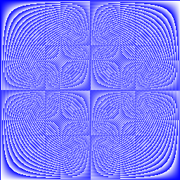
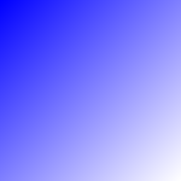
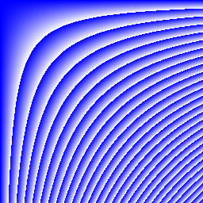

## Learning Golang

Learning from a Tour of Go: https://go.dev/tour/welcome/1

### Exercise: Loops and Functions
```golang
package main

import (
	"fmt"
	"math"
)

func Sqrt(x float64) (i int, z float64) {
	z = 1.0
	i = 0
	for {
		err := (z*z - x)
		z -= err / (2*z)
		fmt.Println(err, z)
		
		if math.Abs(err) < 0.001 { break }
		
		i += 1
	}
	return
}

func main() {
	iters, ans := Sqrt(2)
	fmt.Println(iters, ans)
	
	mathlib_ans := math.Sqrt(2)
	diff := math.Abs(mathlib_ans - ans)
	fmt.Println(diff)
}

```

### Arrays and slices

```golang
package main

import "fmt"

func append2Slices() {
    var s []int
	printSlice(s)

	// append works on nil slices.
	s = append(s, 0)
	printSlice(s)

	// The slice grows as needed.
	s = append(s, 1)
	printSlice(s)

	// We can add more than one element at a time.
	s = append(s, 2, 3, 4)
	printSlice(s)
}

func makeSlices() {
	a := make([]int, 5)
	printSlice("a", a)

	b := make([]int, 0, 5)
	printSlice("b", b)

	c := b[:2]
	printSlice("c", c)

	d := c[2:5]
	printSlice("d", d)
}

func printSlice(s string, x []int) {
	fmt.Printf("%s len=%d cap=%d %v\n",
		s, len(x), cap(x), x)
}

func main() {
    makeSlices()
    append2Slices()
}

```

### Ranges
```go
package main

import "fmt"

func main() {
	pow := make([]int, 10)
	for i := range pow {
		pow[i] = 1 << uint(i) // == 2**i
	}
	for _, value := range pow {
		fmt.Printf("%d\n", value)
	}
}
```

### Exercise: Slices

```go
package main

import "golang.org/x/tour/pic"

func Pic(dx, dy int) [][]uint8 {
    
    out := make([][]uint8, dy)
	
	for i := range out {
	
		out[i] = make([]uint8, dx)
		
		for j := 0; j < dx; j++ {
			z := uint8( i * j )
			out[i][j] = z
		}
	}
	
	return out
}

func main() {
	pic.Show(Pic)
}

```




### Maps

```go
package main

import "fmt"

type Vertex struct {
	Lat, Long float64
}

var m = map[string]Vertex{
	"Bell Labs": {40.68433, -74.39967},
	"Google":    {37.42202, -122.08408},
}

func main() {
	m = make(map[string]Vertex)
	m["Bell Labs"] = Vertex{
		40.68433, -74.39967,
	}
	fmt.Println(m["Bell Labs"])

	m["Answer"] = 42
	fmt.Println("The value:", m["Answer"])

	m["Answer"] = 48
	fmt.Println("The value:", m["Answer"])

	delete(m, "Answer")
	fmt.Println("The value:", m["Answer"])

	v, ok := m["Answer"]
	fmt.Println("The value:", v, "Present?", ok)
}
```

### Exercise: Maps (word count)
```go
package main

import (
	"golang.org/x/tour/wc"
	"strings"
)

func WordCount(s string) map[string]int {
	m := make(map[string]int)
	
	for _,w := range strings.Fields(s) {
		if v, ok := m[w]; ok == true {
			m[w] = v + 1
		} else {
			m[w] = 1
		}
		
	}
	
	return m
}

func main() {
	wc.Test(WordCount)
}

```

### Function values & closures
```go
package main

import (
	"fmt"
	"math"
)

func adder() func(int) int {
	sum := 0
	return func(x int) int {
		sum += x
		return sum
	}
}

func main() {
	pos, neg := adder(), adder()
	for i := 0; i < 10; i++ {
		fmt.Println(
			pos(i),
			neg(-2*i),
		)
	}
}

```

### Exercise: Fibonacci closure
```go
package main

import "fmt"

// fibonacci is a function that returns
// a function that returns an int.
func fibonacci() func() int {
	i := 0
	j := 1
	return func() int {
		fib := i
		i = j
		j += fib
		return fib
	}
}

func main() {
	f := fibonacci()
	for i := 0; i < 10; i++ {
		fmt.Println(f())
	}
}

```